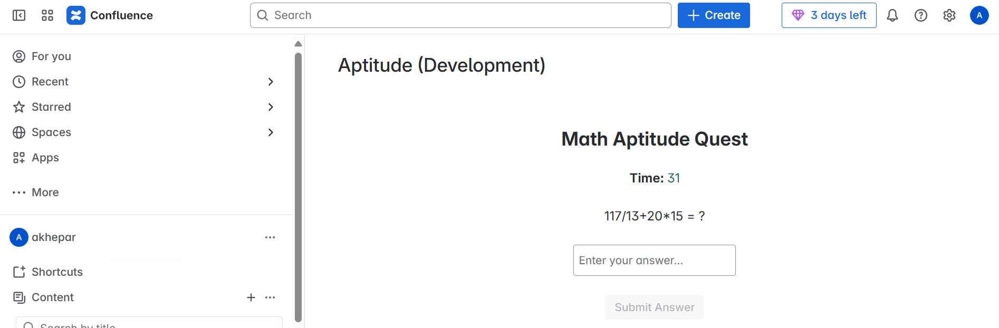
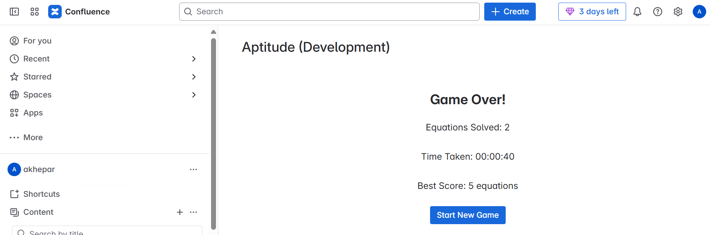

# ForgeQuest

A math aptitude quiz game embedded directly in Confluence, built on the Atlassian Forge platform.


## Preview / Demo

| Quiz in progress | Results screen |
|:---:|:---:|
|  |  |

**Submission:** [Devpost — Aptitude](https://devpost.com/software/aptitude-slb37n)

## Overview

ForgeQuest is a Confluence Space Page app that challenges users with progressively harder arithmetic equations under a countdown timer. It runs entirely inside Confluence via Atlassian Forge — no external server, no separate deployment, no iframe embedding. Players solve equations to survive as long as possible while the difficulty and complexity increase with each correct answer. Best scores persist across sessions using Forge's built-in key-value storage.

## Highlights

- **Adaptive difficulty engine** — equation complexity scales continuously from a difficulty factor of `0.1` to `1.0` as the player's score grows, controlling equation depth, number of terms, and nesting level
- **Procedural equation generation** — equations are constructed at runtime from randomized multiplication, division, addition, and subtraction terms, with optional nested sub-expressions wrapped in parentheses
- **Forge-native persistence** — best scores are stored via `@forge/api` storage, requiring no external database and inheriting Atlassian's security and data residency guarantees
- **Countdown timer with reward mechanics** — the timer starts at 30 seconds; each correct answer adds 5 seconds, creating a survival-style loop rather than a fixed-round structure
- **Zero-infrastructure deployment** — the entire app (frontend, resolver, storage) runs on Forge's managed runtime; `forge deploy` is the only deployment step

## Features

### Gameplay
- Countdown timer starting at 30 seconds per session
- Correct answer awards +5 seconds and immediately loads the next equation
- Wrong answer or timeout ends the game and shows a results screen
- Session stats displayed: equations solved, total time taken, all-time best score

### Equation Engine
- Four operation types: addition, subtraction, multiplication, division
- Division pairs are generated as exact integers to avoid floating-point ambiguity
- Nested sub-expressions at higher difficulty levels (e.g., `(12*3+8/4)+15*2`)
- Equation size and depth controlled by a single `difficulty` parameter (0.1–1.0)

### Persistence
- Best score saved to Forge app storage under the `bestScore` key
- Score is fetched on app load and updated whenever a session beats the prior record

## Tech Stack

| Layer | Technology | Purpose |
|---|---|---|
| Frontend | React 18, `@forge/react` | UI components (Heading, Button, Text, Textfield, Stack, Box, Inline) |
| Bridge | `@forge/bridge` | Invoke backend resolver functions from the frontend |
| Backend | `@forge/resolver` | Define server-side functions for storage access |
| Storage | `@forge/api` storage | Persistent key-value store for best score |
| Platform | Atlassian Forge (Node.js 22.x) | Managed serverless runtime hosting the full app |
| Linting | ESLint 8, eslint-plugin-react-hooks | Code quality enforcement |

## Architecture

```mermaid
flowchart TD
    CP[Confluence Space Page] --> FE[React Frontend\nsrc/frontend/index.jsx]
    FE -->|invoke getBestScore| BR[@forge/bridge]
    FE -->|invoke setBestScore| BR
    BR --> RS[Forge Resolver\nsrc/resolvers/index.js]
    RS -->|storage.get / storage.set| FS[Forge App Storage]
    FE -->|local call| GEN[Equation Generator\nsrc/data/generate.js]
    GEN -->|generateFinalEquation| FE
```

## How It Works

1. **App load** — the React component mounts inside the Confluence Space Page and immediately fetches the stored best score via `invoke('getBestScore')`.
2. **Equation generation** — `generateFinalEquation(difficulty)` builds an arithmetic expression from randomized term pairs. Difficulty starts at `0.1` and grows linearly with the number of equations solved, reaching maximum complexity at 20 correct answers.
3. **Gameplay loop** — the player reads the displayed equation, types a numeric answer, and submits. The answer is compared against the pre-computed `answer` value (rounded to two decimal places).
4. **Correct answer** — the timer gains 5 seconds, a new equation is generated at the updated difficulty, and the next round begins automatically after a 1-second feedback pause.
5. **Wrong answer or timeout** — the game ends. If the current score exceeds the stored best, `invoke('setBestScore', { score })` writes the new record to Forge storage.
6. **Results screen** — shows equations solved, elapsed session time (formatted as `HH:MM:SS`), and the all-time best score, with an option to restart.

## Setup

**Prerequisites**

- Node.js 18+
- Atlassian Forge CLI: `npm install -g @forge/cli`
- An Atlassian developer account with a Confluence cloud site

**Install dependencies**

```bash
npm install
```

**Authenticate with Forge**

```bash
npx forge login
```

**Deploy the app**

```bash
npx forge deploy
```

**Install onto a Confluence site**

```bash
npx forge install
```

**Local development (tunnel mode)**

```bash
npx forge tunnel
```

**Lint**

```bash
npm run lint
```

> After the initial `forge install`, subsequent `forge deploy` calls update the live app without reinstalling.

## Usage

Once installed, the app appears as a Space Page at the `/aptitude` route within any Confluence space where it has been added.

**Starting a game**

Navigate to the Confluence Space Page where the app is installed. The "Math Aptitude Quest" interface loads immediately with a 30-second timer and the first equation.

**Answering a question**

```
Equation displayed:  12*7+18/3 = ?
Your input:          90
Result:              Correct! Well done!  (+5 seconds added)
```

**Game over screen**

```
Equations Solved:  14
Time Taken:        00:01:42
Best Score:        17 equations
```

**Upgrading the install after code changes**

```bash
npx forge install --upgrade
```

## Key Decisions

| Decision | Rationale | Tradeoff |
|---|---|---|
| Forge platform over a standalone web app | Embeds natively in Confluence with no infrastructure to manage; auth and data residency handled by Atlassian | Constrained to Forge UI Kit components; no arbitrary CSS or external CDN assets |
| Pre-computed answers in the generator | Answers are calculated server-side at generation time, keeping comparison logic trivial and avoiding eval | Floating-point rounding required (`toFixed(2)`) for division results to match user input reliably |
| Single `difficulty` float controlling all complexity axes | One parameter drives equation size, depth, and nesting simultaneously, keeping the API simple | Cannot independently tune depth vs. term count without refactoring the generator |
| Timer-reward mechanic (+5s per correct answer) | Favors sustained accuracy over raw speed; keeps the game alive for skilled players | A player who answers very slowly could extend a session indefinitely in theory |
| Forge app storage for best score | Zero additional services; inherits Atlassian's security model automatically | Storage is scoped per app installation; scores do not sync across multiple Confluence sites |

## Innovation / Notable Work

The equation generator (`src/data/generate.js`) is the most technically interesting part of the project. Rather than selecting from a pre-built question bank, it constructs equations structurally at runtime. `generateFinalEquation` composes multiple calls to `generateEquation`, each of which randomly selects an operation category and generates valid operand pairs for that category — division pairs are always generated as `[i*j, j]` to guarantee integer results, avoiding the common trap of presenting unanswerable floating-point divisions.

At higher difficulty levels, sub-equations are wrapped in parentheses and combined with a second sub-expression, producing multi-level nested expressions like `(12*3+8/4)+(15-6/2)`. This nesting is controlled probabilistically (70/30 addition vs. subtraction split), so each game session generates a meaningfully different distribution of question shapes without any hardcoded question set.

The survival mechanic — timer reward on correct answer rather than a fixed round structure — was a deliberate product choice that naturally paces difficulty progression: a player who answers quickly accumulates a time buffer that lets them tackle harder equations calmly.

## About

Built as an exploration of the Atlassian Forge platform and its Custom UI capabilities. The project demonstrates how a fully interactive game with persistent state can be shipped entirely within the Confluence ecosystem using only Forge's managed runtime, storage API, and React component library — without any external backend or database.
